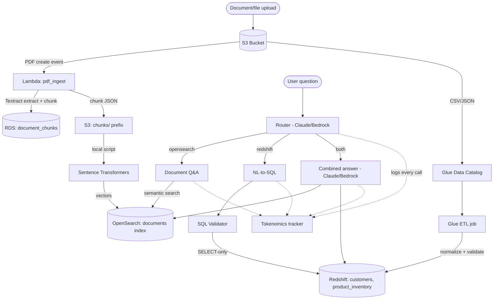

# Unit 3 Capstone: Intelligent Document Search Pipeline

AWS pipeline for ingesting unstructured (PDF) and structured (CSV/JSON)
documents, making them searchable via semantic search (OpenSearch) and
SQL (Redshift), with a Bedrock/Claude-powered natural-language query layer.

## Status

Bronze checklist:

- [x] S3 stores raw PDFs, CSVs, and JSONs
- [x] Lambda triggers on upload; calls Textract for PDFs
- [x] Textract extracts and chunks PDF text (500-1000 tokens, word-count proxy)
- [x] Sentence Transformers generates document embeddings
- [x] Raw text stored in RDS; embeddings in OpenSearch
- [x] Glue Crawler catalogs and discovers data schemas (adapted: crawler creation is
      denied in this sandbox account, so schemas are defined directly via boto3 --
      see `docs/architecture.md`)
- [x] Glue ETL normalizes, validates, and loads CSV/JSON into Redshift
- [x] Redshift consolidates structured data (vector embeddings live in OpenSearch)
- [x] Matplotlib charts (2+) visualize Redshift data -- see `charts/`
- [x] Lambda and boto3 automate flows
- [x] IAM secures resources (scoped-down/inline policies throughout; see
      `docs/architecture.md` for documented tradeoffs)
- [ ] AI query layer: routing, NL-to-SQL, contextual document response --
      **code complete, blocked on a Bedrock model-access permission issue
      outside this codebase; see `docs/architecture.md`**. Logic that
      doesn't require a live model call (JSON parsing, SQL cleanup, the
      validator gate inside SQL execution) is unit tested independently
      -- 11/11 passing, see `docs/ai_query_layer_logic_test_results.txt`
- [x] SQL validation layer implemented and tested (7/7 cases, including a
      stacked-query attack) -- see `docs/sql_validation_results.txt`
- [ ] Tokenomics logging + 10-query cost summary -- logging is implemented
      (`tokenomics/tracker.py`), blocked on the same Bedrock access issue
- [ ] Both harder synthesis queries answered, citing both sources --
      expected behavior documented in `docs/architecture.md`, pending
      Bedrock access to capture actual output

## Project layout

```
boto3_scripts/     Infra setup + standalone smoke tests (run test_bedrock.py first)
lambda/            Lambda function handlers (PDF ingest, ETL triggers)
glue_jobs/         Glue Crawler config + ETL job scripts
ai_query_layer/     Routing, NL-to-SQL, document QA (built on Bedrock)
sql_validation/     SQL validator + its test suite
tokenomics/         Per-call token/cost logging + summary report
charts/             Matplotlib chart generation from Redshift data
docs/               Architecture diagram, setup notes, test results
data/               Local sample PDFs / CSV / JSON for testing
tests/              End-to-end pipeline tests
```

## Setup

```bash
python -m venv venv
source venv/bin/activate  # or venv\Scripts\activate on Windows
pip install -r requirements.txt
cp .env.example .env  # fill in AWS account id, region, resource names
```

## First thing to run

Before doing anything else with the AI query layer, confirm Bedrock access works:

```bash
python boto3_scripts/test_bedrock.py
```

**Known issue as of submission**: this currently fails with an
`AccessDeniedException` about AWS Marketplace subscription permissions
(`aws-marketplace:ViewSubscriptions`, `aws-marketplace:Subscribe`) --
confirmed to be an account-level permissions issue, not a code issue
(the exact same error occurs calling this via boto3 *and* through the
Bedrock console's own "Open in playground" feature, using the same IAM
identity). This same call worked earlier in the project, so access was
revoked/lapsed afterward. See `docs/architecture.md` for full details.
**If you're reading this with working Bedrock access, see "Running the
AI query layer" below.**

## Running the AI query layer (once Bedrock access works)

All the code is written and ready -- these are the steps to actually
exercise it and capture real results:

1. **Confirm access**: `python boto3_scripts/test_bedrock.py` should print
   `Bedrock connection OK`.
2. **Sanity-check routing and document Q&A** (these only need
   OpenSearch + Bedrock, no Redshift connection):
   ```bash
   python ai_query_layer/router.py
   python ai_query_layer/document_qa.py
   ```
3. **Run the two required harder queries** and confirm the answers make
   sense against the "Expected behavior" section in `docs/architecture.md`:
   ```bash
   python -c "from ai_query_layer.query_engine import answer_question; import json; print(json.dumps(answer_question('Does our current customer churn rate (from the data warehouse) align with what our documented retention strategy says we should be seeing?'), indent=2, default=str))"
   python -c "from ai_query_layer.query_engine import answer_question; import json; print(json.dumps(answer_question('Based on our data governance policy documents, are any of the currently-ingested datasets missing required metadata fields (check against the Glue Catalog)?'), indent=2, default=str))"
   ```
   **Note**: these two route to `"both"`, which executes SQL against
   Redshift via a direct Postgres-wire connection (`pg8000`). If this
   hangs or times out, your network is likely blocking that protocol/port
   (this happened during development) -- run the same commands from AWS
   CloudShell instead, where it's confirmed to work.
4. **Run the full 10-query tokenomics test**:
   ```bash
   python tokenomics/cost_summary.py
   ```
   This prints a per-call-type and total token/cost summary at the end.
5. **Update `docs/architecture.md`**'s "Test results" section with the
   actual output from steps 3-4, replacing the "expected behavior"
   placeholder text.

## Architecture



See `docs/architecture.md` for the full data-flow write-up, every
sandbox/network constraint hit during development and how it was worked
around, and the expected-vs-actual test results for both harder queries.
