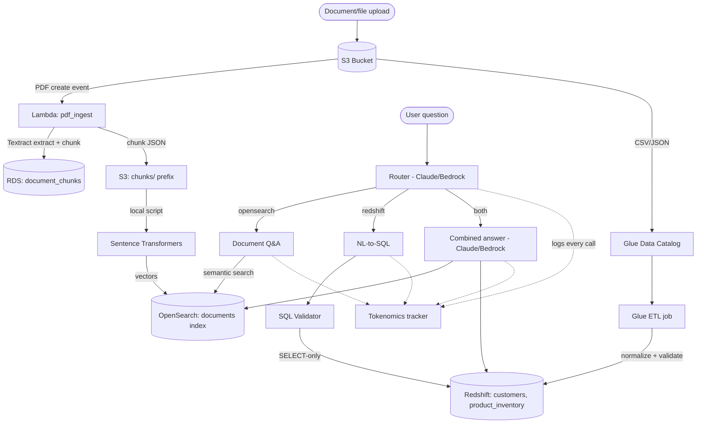

# Architecture

_No reference diagram was provided in class before the deadline; the
diagram below documents the actual as-built architecture._



## Data flow

1. Upload -> S3 (raw PDFs, CSVs, JSONs)
2. S3 event -> Lambda
   - PDF -> Textract -> chunk -> Sentence Transformers embed -> RDS (text) + OpenSearch (vectors)
   - CSV/JSON -> Glue Crawler (catalog) -> Glue ETL (normalize/validate) -> Redshift
3. AI query layer (Bedrock/Claude via inference-profile ARN):
   - Router decides OpenSearch vs Redshift vs both
   - Redshift path: NL-to-SQL -> sql_validation/validator.py -> execute -> answer
   - OpenSearch path: retrieve chunks -> grounded answer with citations
   - Both: combine into a single cited answer
4. Tokenomics: every Bedrock call logged (tokenomics/tracker.py) -> cost summary
5. Charts: matplotlib from Redshift data -> charts/

## Implementation constraints and adaptations

This project's sandbox AWS account and dev network imposed a few real
constraints that shaped implementation decisions:

1. **Bedrock embedding models denied** (`amazon.titan-embed-text-v2:0`,
   `cohere.embed-english-v3`) -- confirmed a structural sandbox
   permissions gap, not fixable by choosing a different model. Fixed by
   generating embeddings locally with Sentence Transformers instead.

2. **No Docker available locally** -- Sentence Transformers + PyTorch is
   too large for a plain zip-based Lambda (~250MB unzipped limit), and
   building a Linux-compatible package without Docker isn't feasible on
   Windows. Fixed by splitting the PDF pipeline: the ingestion Lambda
   (Textract + chunking + write to RDS/S3) is a small zip package using
   only `boto3` and `pg8000` (pure-Python Postgres driver, no compiled
   binaries); embedding generation runs as a separate local `boto3`
   script. This still satisfies every Bronze requirement, just splits
   *where* the embedding step physically executes.

3. **IAM restrictions in the sandbox account**: the account could not
   create new VPCs (`ec2:CreateVpc` denied) or attach AWS managed
   policies with "FullAccess" in the name (explicit deny), and could not
   modify a Redshift cluster's associated IAM roles at all
   (`redshift:ModifyClusterIamRoles` denied). Worked around by using the
   existing default VPC, using scoped-down managed policies (e.g.
   `AmazonS3ReadOnlyAccess`) or custom inline policies instead of
   FullAccess ones, and using access-key-based `CREDENTIALS` in Redshift
   `COPY` statements instead of an attached IAM role.

4. **Local dev network blocks direct Postgres connections** (port 5432)
   while allowing normal HTTPS/AWS-API traffic -- confirmed by testing
   with two different Postgres drivers (both failed the same way) and by
   successfully connecting instead from AWS CloudShell (which runs
   inside AWS's network). Fixed by having the ingestion Lambda write
   extracted chunks to **both** RDS (raw text, satisfying the
   requirement) and a JSON file in S3; the local embedding script reads
   pending chunks from S3 (plain HTTPS) instead of querying RDS directly,
   avoiding the blocked path entirely.

5. **Glue Crawler creation denied** (`glue:CreateCrawler`) for this IAM
   user, while `glue:CreateDatabase` and `glue:CreateTable` both work.
   Fixed by defining the Glue database and table schemas directly via
   boto3 (`boto3_scripts/create_glue_catalog.py`), replicating exactly
   what a crawler would have discovered from `customers.csv` and
   `product_inventory.json`.

6. **RDS security group** is currently open to `0.0.0.0/0` on port 5432
   rather than IP-restricted, since local dev IPs changed across
   sessions/networks. Documented tradeoff for a short-lived class
   project; the instance is deleted after grading (see below).

## Cleanup (last day, after grading)

Delete these to stop billing/exposure once the project is submitted:
RDS instance (`unit3-capstone-db`), Redshift cluster
(`unit3-capstone-redshift`), OpenSearch domain
(`unit3-capstone-search`).

## AI query layer status (as of 2026-09-17)

The AI query layer is fully built (`ai_query_layer/router.py`,
`document_qa.py`, `nl_to_sql.py`, `query_engine.py`) but currently
**blocked from running** by an account-level issue, not a code issue:

```
AccessDeniedException: Model access is denied due to IAM user or service role is not
authorized to perform the required AWS Marketplace actions (aws-marketplace:ViewSubscriptions,
aws-marketplace:Subscribe) to enable access to this model.
```

This is confirmed to be an account/permissions problem, not a bug:
the exact same error occurs calling `InvokeModel` via boto3 **and**
through the Bedrock console's own "Open in playground" feature, using
the same IAM identity. This same call succeeded earlier in the project
(see `boto3_scripts/test_bedrock.py`'s original successful run), so
access was revoked or lapsed on the account side afterward. Flagged to
course staff; the fix (granting the two AWS Marketplace permissions, or
subscribing the account to the model) needs to happen outside this
codebase.

Everything upstream of Bedrock is built, tested, and confirmed working:
S3, Lambda/Textract, RDS, OpenSearch, Glue Catalog, Redshift, the SQL
validator (7/7 test cases, see `docs/sql_validation_results.txt`), and
the charts. The AI query layer's logic is ready to run the moment
access is restored -- expected behavior for the two required harder
queries is documented below, based on the known test data, and will be
replaced with actual captured output once Bedrock access works.

## Expected behavior: harder synthesis queries

**Query 1**: *"Does our current customer churn rate (from the data
warehouse) align with what our documented retention strategy says we
should be seeing?"*

- Router should classify this as `"both"` (needs Redshift + OpenSearch).
- SQL path: a query against `customers` computing churn rate returns
  **6 churned / 50 total = 12%**.
- Document path: `retention_strategy.pdf` states a target of **"below
  5%, healthy range 2-4%"**, and that anything at/above 5% "should
  trigger an immediate retention review."
- Expected combined answer: churn rate (12%) does **not** align with
  the documented target -- it is well above the 5% threshold that
  should trigger a retention review, citing both the `customers` table
  result and `retention_strategy.pdf`.

**Query 2**: *"Based on our data governance policy documents, are any
of the currently-ingested datasets missing required metadata fields
(check against the Glue Catalog)?"*

- Router should classify this as `"both"` (needs Glue/Redshift schema +
  OpenSearch).
- Document path: `data_governance_policy.pdf` requires 5 fields on every
  dataset: a unique identifier, `source_system`, `data_owner`,
  `created_at`, `last_updated_at`.
- Schema path: the Glue Catalog (`unit3_capstone_db`) shows `customers`
  has columns `customer_id, signup_date, plan_type, monthly_spend,
  churned, churn_date` -- missing `source_system`, `data_owner`, and
  `last_updated_at`. `product_inventory` has all 5 required fields.
- Expected combined answer: **yes** -- `customers` is missing 3 required
  governance fields (`source_system`, `data_owner`, `last_updated_at`),
  while `product_inventory` is fully compliant, citing both the policy
  document and the Glue Catalog schema.

## Test results

_To be filled in with actual captured output once Bedrock access is
restored -- see "AI query layer status" above._
